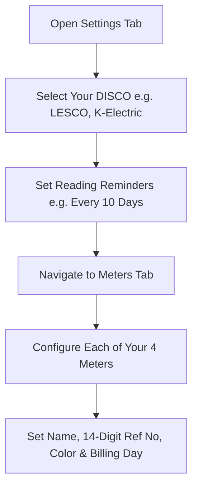

# Meter Record (میٹر ریکارڈ) • Complete User Guide

> **Master Your Household Electricity • Keep All Meters Protected • Never Pay Late Surcharges**

Welcome to **Meter Record**! This guide walks you through every feature of the app, designed specifically for Pakistani homeowners managing single or multiple independent electricity meters (e.g. *Main House*, *Garage*, *Studio*, *Basement*).

---

## 📑 Table of Contents
1. [Why Meter Record? (The 200-Unit Protected Slab Strategy)](#1-why-meter-record-the-200-unit-protected-slab-strategy)
2. [Initial Setup & Configuring Your Meters](#2-initial-setup--configuring-your-meters)
3. [Logging Daily/Weekly Meter Readings](#3-logging-dailyweekly-meter-readings)
4. [Monitoring Usage Tiers & Pacing Projections](#4-monitoring-usage-tiers--pacing-projections)
5. [Consolidated Household Monthly Bills & Due Dates](#5-consolidated-household-monthly-bills--due-dates)
6. [30-Second Batch Bill Entry Guide](#6-30-second-batch-bill-entry-guide)
7. [1-Tap Bill Payment & Copying Reference Numbers](#7-1-tap-bill-payment--copying-reference-numbers)
8. [Trends, Historical Comparisons & Heatmaps](#8-trends-historical-comparisons--heatmaps)
9. [Bilingual Urdu Support (اردو)](#9-bilingual-urdu-support-اردو)
10. [Home Screen Widgets](#10-home-screen-widgets)
11. [Data Privacy, Backups & PDF Exports](#11-data-privacy-backups--pdf-exports)
12. [Frequently Asked Questions (FAQ)](#12-frequently-asked-questions-faq)

---

## 1. Why Meter Record? (The 200-Unit Protected Slab Strategy)

In Pakistan, domestic electricity tariffs set by NEPRA follow steep, non-linear progressive slabs:

* **Protected Category ($\le 200$ kWh/month)**: Households that consume 200 units or less per month pay a subsidized lifeline tariff (typically **Rs 14 to Rs 20 per unit** including base tariff and taxes).
* **The Tariff Cliff ($\ge 201$ kWh/month)**: If even a single meter crosses into **201 units**, the tariff jumps immediately to **Rs 45 to Rs 60+ per unit**.
* **The 6-Month Penalty Rule**: Crossing 200 units on a bill revokes your Protected status for the next **6 consecutive billing cycles**, causing an extra expense of tens of thousands of rupees over the year!

### The Multi-Meter Advantage
To stay within the protected band legally, many homes distribute their electrical load across multiple physical meters (for example: **4 independent LESCO meters** mounted on a shared board for Ground Floor, Upper Floor, Studio, and Basement/Garage). 

**Meter Record** acts as your central command center to monitor all connections side-by-side, predict your month-end finish, and alert you days in advance if any meter is at risk of crossing 200 units.

---

## 2. Initial Setup & Configuring Your Meters

When you first open Meter Record, configure your settings to match your household setup:

1. **Select Your Electricity Provider (DISCO)**:
   * Tap the **Settings** tab (gear icon at the bottom right).
   * Tap **Electricity Provider (DISCO)** and pick your regional provider: **LESCO** (Lahore), **K-Electric** (Karachi), **IESCO** (Islamabad), **FESCO**, **GEPCO**, **MEPCO**, etc.
2. **Configure Your Usage Thresholds**:
   * Under **Usage thresholds**, confirm the default targets:
     * **Warn**: `150 kWh`
     * **Ceiling**: `200 kWh` (the strict protected ceiling)
3. **Add or Customize Your Meters**:
   * Go to the **Meters** tab.
   * Tap any meter card to edit its details or tap `+` to add a connection:
     * **Meter Name**: Give it an intuitive label matching your home layout (*Main House*, *Garage*, *Studio*, *Basement*).
     * **Reference Number**: Enter the 14-digit consumer reference number printed on your LESCO bill (e.g. `01 12345 6789001`).
     * **Color Tag**: Assign a distinct color to visually differentiate meters across charts.
     * **Billing Cycle Day**: The day of the month your DISCO meter reader visits your house (e.g., 5th of each month).

---

## 3. Logging Daily/Weekly Meter Readings

Regular readings allow the app to project your month-end consumption accurately.

### How to Read a Digital Single-Phase Electricity Meter:
1. Look at the digital LCD screen on your meter.
2. The screen automatically cycles through several screens every 5–10 seconds:
   * Screen 1: Date & Time
   * Screen 2: **Active Cumulative Import Energy (kWh)** $\leftarrow$ *This is the number you need!*
   * Screen 3: Instantaneous Load (kW)
   * Screen 4: Voltage (V)
3. Take note of the whole numbers before the decimal point (e.g., if the meter reads `04202.4`, your reading is `4202`).

### Logging the Reading in the App:
1. Tap the prominent **Electric Lime `+` button** at the bottom center of any screen.
2. Tap the meter you are logging for (e.g., *Main House*).
3. Type the reading using the high-contrast custom numeric keypad (or tap the microphone icon for **Voice Entry**).
4. Tap **Save Reading**.
5. Repeat for your other meters. The whole process takes less than 60 seconds for all 4 meters!

> [!TIP]
> **Recommended Frequency**: Log readings once every 7 to 10 days, or whenever you receive a reading reminder notification.

---

## 4. Monitoring Usage Tiers & Pacing Projections

Once you log two or more readings in a cycle, Meter Record's projection engine calculates your daily burn rate:

### 1. Cycle Consumption & Projections
At the top of the **Home** tab, you will see:
* **Current Total**: Total units consumed across all meters so far this cycle (e.g. `522 kWh across 4 meters`).
* **Pacing Forecast**: `On pace to finish this cycle at ≈870 kWh` (combined).

### 2. Understanding Usage Tier Badges
Each meter displays an active status badge based on its pacing toward the 200 kWh ceiling:

| Tier | Units Range | Color Badge | Recommended Action |
| :--- | :--- | :--- | :--- |
| **OK / Safe** | $0–150$ kWh | 🟢 **Safe** | Normal usage. Pace is well within the protected limit. |
| **Caution** | $151–175$ kWh | 🟡 **Caution** | Approaching warning zone. Monitor AC and heavy appliances. |
| **Warning** | $176–199$ kWh | 🟠 **Warning** | **Critical zone!** Shift heavy loads to another meter immediately. |
| **Danger** | $\ge 200$ kWh | 🔴 **Danger** | 200 units exceeded. Protected tariff lost for this cycle. |

### 3. Home Screen Warning Banners
If any meter is pacing too fast or crosses 175 units, a high-visibility warning banner appears on the Home dashboard:
> `⚡ Studio has used past 175 units this cycle — keep it under 200`

---

## 5. Consolidated Household Monthly Bills & Due Dates

When monthly bills arrive from LESCO or K-Electric, they are logged and tracked in the **Household Bills Overview**.

### How to Access Household Bills:
* Tap the **Household Bills Card** on the Home tab (`⚡ Household Bills • JULY 2026 ›`).
* Or tap any urgent due-date warning banner on Home.

### What You See on the Dashboard:
1. **Month Selector Carousel**: Easily switch between billing months (`July 2026`, `June 2026 ✓`, `May 2026 ✓`).
2. **Consolidated Household Total Hero Card**:
   * **Total Combined Bill**: Large headline showing total household expense (e.g. `Rs 10,640`).
   * **Total Household Units**: Combined units billed across all 4 meters (e.g. `522 kWh`).
   * **Effective Rate per Unit**: True average cost per kWh (e.g. `Rs 20.38/unit`).
   * **Paid vs Unpaid Progress Bar**: Visual split showing total rupees paid vs remaining unpaid balance (`Paid: Rs 2,490` vs `Unpaid: Rs 8,150`).
3. **Side-by-Side Meter Breakdown Cards**:
   * Individual bill amount (e.g. `Rs 2,850`).
   * Units billed and `≤200` protected badge indicator.
   * Clean 14-digit reference number with 1-tap clipboard copy.
   * Payment due date and overdue warning pill (e.g. `Due Date: 18 Jul • Overdue 55 d`).
   * Instant **"Mark Paid" / "Mark Unpaid"** toggle.

---

## 6. 30-Second Batch Bill Entry Guide

Instead of opening 4 different screens to enter your monthly bills, use the **Batch Bill Entry Modal**:

### Step-by-Step Instructions:
1. Open the **Household Bills** screen.
2. Tap the **`+ Record Month Bills`** button in the top right corner.
3. Verify or adjust the **Bill Date** and **Due Date** (defaults to standard monthly anchor dates).
4. Enter the units and rupee amounts from each paper or SMS bill:
   * **Main House**: Units billed (e.g. `145`), Amount paid (e.g. `2900`)
   * **Garage**: Units billed (e.g. `130`), Amount paid (e.g. `2600`)
   * **Studio**: Units billed (e.g. `180`), Amount paid (e.g. `3800`)
   * **Basement**: Units billed (e.g. `70`), Amount paid (e.g. `1300`)
5. Notice the **Live Household Total** calculating automatically at the bottom:
   `Household Total: Rs 10,600 • 525 kWh`
6. Tap **Save All Bills**. All 4 bills are recorded into the database simultaneously!

---

## 7. 1-Tap Bill Payment & Copying Reference Numbers

Late-payment surcharges in Pakistan add 8% to 10% on top of an already high electricity bill. Meter Record helps you pay on time and stay organized:

### 1. Urgent Due-Date Banner on Home
When a bill is approaching its due date or is overdue, Home shows a banner:
> `⚠️ Main House bill (Rs 2,850) is due 18 Jul — avoid late surcharge! ›`

### 2. 1-Tap Copy Reference Number
Never mistype a 14-digit reference number into your mobile banking app:
1. On any meter bill card, tap the small clipboard icon next to the reference number (`01 12345 6789001 📋`).
2. The clean 14-digit number is copied directly to your Android clipboard.
3. Switch to your banking app (**Meezan Mobile**, **Nayapay**, **SadaPay**, **Easypaisa**, or **JazzCash**).
4. Paste the number into the Utility Bills section — your bill details load instantly!

### 3. Mark as Paid with 1 Tap
* Once paid, tap **"Mark Paid"** on the card.
* Enter a quick payment method note (e.g., `Meezan App`, `Nayapay`, `Cash`).
* The button turns into a green **`✓ Paid`** badge, and the Household Total progress bar updates instantly.

---

## 8. Trends, Historical Comparisons & Heatmaps

Tap the **Trends** tab (chart icon on the bottom navigation bar) to analyze your long-term energy habits:

* **Cycle-by-Cycle Comparison**: Compare consumption across consecutive billing cycles to identify which seasons or appliances trigger consumption spikes.
* **Meter-by-Meter Distribution**: See which connection consumes the biggest slice of your household's total electricity.
* **Consumption Heatmap**: Visual grid showing day-by-day intensity spikes (darker tiles represent heavy usage days).

---

## 9. Bilingual Urdu Support (اردو)

Meter Record provides full, native Right-to-Left (RTL) Urdu translation:

### How to Switch to Urdu:
1. Tap the **Settings** (ترتیبات) tab.
2. In the **Language (زبان)** row, tap **`اردو`**.
3. The entire interface switches immediately to Right-to-Left layout with natural Urdu phrasing:
   * *Household Bills* $\rightarrow$ **گھریلو بجلی کے بل**
   * *Record Month Bills* $\rightarrow$ **پورے مہینے کے بل درج کریں**
   * *Mark as Paid* $\rightarrow$ **ادا شدہ نشان لگائیں**
   * *Due Date Warning* $\rightarrow$ **کا بل واجب الادا ہے — اضافی چارجز سے بچیں!**

---

## 10. Home Screen Widgets

You don't even need to open the app to monitor your meters.

### Adding the Android Glance Widget:
1. Go to your Android phone's Home screen.
2. Long-press on any empty space and tap **Widgets**.
3. Scroll down and locate **Meter Record**.
4. Drag the widget onto your home screen and resize it as desired.
5. The widget displays live per-meter kWh readings and tier statuses at a glance!

---

## 11. Data Privacy, Backups & PDF Exports

Your data belongs strictly to you. Meter Record does not upload your readings to external cloud servers.

### Exporting Reports:
1. Go to **Settings**.
2. Tap **Export PDF report**: Generates a professional, print-ready PDF summary of your cycle consumption and bills.
3. Tap **Export data (CSV)**: Generates a CSV spreadsheet compatible with Microsoft Excel and Google Sheets.

### Backup & Restore:
* **Back up data**: Tap **Back up data** in Settings to generate a timestamped JSON backup file. Save it to your Google Drive, WhatsApp, or local storage.
* **Restoring**: If you switch to a new phone, install Meter Record, tap **Restore backup**, and select your saved JSON file. All meters, history, and bills will be restored instantly.
* **App Lock**: Toggle **App lock** in Settings to protect the app with your device fingerprint or PIN.

---

## 12. Frequently Asked Questions (FAQ)

**Q1: What if my LESCO meter reader visits on different dates each month?**  
> *A: DISCO meter reading dates can fluctuate by 2–4 days. In Meter Record, you can set your anchor day (e.g. 5th), but whenever you log a reading or bill, you can select the exact actual date. The app automatically calculates daily burn rates based on real elapsed days.*

**Q2: Can I edit a reading if I typed the wrong number?**  
> *A: Yes! Tap the meter from the Meters tab, go to the **Readings** tab, tap the reading you want to fix, and edit or delete it.*

**Q3: Can I change my meter's reference number later?**  
> *A: Yes. Go to the Meters tab, select the meter, tap the edit icon, and update the 14-digit reference number anytime.*

**Q4: Does the app estimate NEPRA taxes or fuel price adjustments (FPA)?**  
> *A: Meter Record calculates your true effective Rs/unit directly from your **actual recorded bills** ($Total\ Amount \div Total\ Units$). Because NEPRA FPAs and surcharges change unpredictably each month, this avoids inaccurate guesswork and provides 100% genuine financial data.*

**Q5: What should I do if one meter is about to cross 200 units mid-month?**  
> *A: If you notice a meter in the Warning Orange zone ($176–199$ kWh), immediately switch heavy loads (e.g., move an inverter AC or heavy kitchen appliances) to one of your other meters currently in the Safe Green zone. This preserves your protected status across all connections.*
